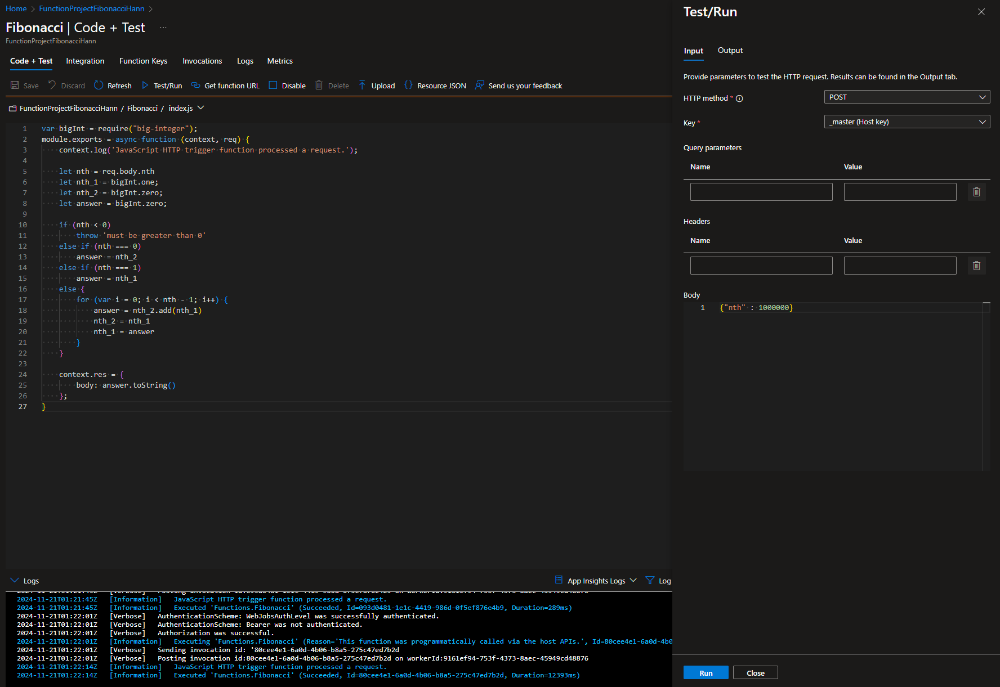

### Escuela Colombiana de Ingeniería
### Arquitecturas de Software - ARSW

### Integrante:
* Hann Jang

## Escalamiento en Azure con Maquinas Virtuales, Sacale Sets y Service Plans

### Dependencias
* Cree una cuenta gratuita dentro de Azure. Para hacerlo puede guiarse de esta [documentación](https://azure.microsoft.com/es-es/free/students/). Al hacerlo usted contará con $100 USD para gastar durante 12 meses.
Antes de iniciar con el laboratorio, revise la siguiente documentación sobre las [Azure Functions](https://www.c-sharpcorner.com/article/an-overview-of-azure-functions/)

### Parte 0 - Entendiendo el escenario de calidad

Adjunto a este laboratorio usted podrá encontrar una aplicación totalmente desarrollada que tiene como objetivo calcular el enésimo valor de la secuencia de Fibonnaci.

**Escalabilidad**
Cuando un conjunto de usuarios consulta un enésimo número (superior a 1000000) de la secuencia de Fibonacci de forma concurrente y el sistema se encuentra bajo condiciones normales de operación, todas las peticiones deben ser respondidas y el consumo de CPU del sistema no puede superar el 70%.

### Escalabilidad Serverless (Functions)

1. Cree una Function App tal cual como se muestra en las  imagenes.

Se creo la Fuction de Fibonacci en Azure

2. Instale la extensión de **Azure Functions** para Visual Studio Code.

3. Despliegue la Function de Fibonacci a Azure usando Visual Studio Code. La primera vez que lo haga se le va a pedir autenticarse, siga las instrucciones.

4. Dirijase al portal de Azure y pruebe la function.

Imagenes de la prueba en el portal de Azure;

5. Modifique la coleción de POSTMAN con NEWMAN de tal forma que pueda enviar 10 peticiones concurrentes. Verifique los resultados y presente un informe.

6. Cree una nueva Function que resuleva el problema de Fibonacci pero esta vez utilice un enfoque recursivo con memoization. Pruebe la función varias veces, después no haga nada por al menos 5 minutos. Pruebe la función de nuevo con los valores anteriores. ¿Cuál es el comportamiento?.

Se realiza el cambio y se ejecuta:

En las imagenes que siguen podemos ver que una diferencia de varios minutos y vemos una reducción en el tiempo. 

**Preguntas:**

#### **¿Qué es un Azure Function?**
Azure Functions es un servicio de computación en la nube proporcionado por Microsoft Azure que permite ejecutar pequeños fragmentos de código (llamados "functions") en respuesta a eventos específicos. Es ideal para tareas de automatización, procesamiento de datos y aplicaciones event-driven, sin necesidad de gestionar servidores o infraestructura.

#### **¿Qué es serverless?**
El término **serverless** se refiere a un modelo de computación en el que los desarrolladores no necesitan gestionar ni mantener servidores. Los recursos se asignan automáticamente y se escalan dinámicamente según la demanda, y los costos se basan únicamente en el uso real. Aunque el término implica "sin servidores", en realidad los servidores existen, pero su gestión es completamente abstracta para el usuario.

#### **¿Qué es el runtime y qué implica seleccionarlo al momento de crear el Function App?**
El **runtime** define el entorno en el que se ejecutará el código de tu función, incluyendo el lenguaje de programación, las bibliotecas y las configuraciones necesarias. Al seleccionar el runtime:
- Se define el lenguaje de desarrollo (por ejemplo, Node.js, Python, .NET, Java).
- Se determinan las versiones de las dependencias disponibles.
- Se asegura la compatibilidad con el código que escribirás.

La elección del runtime es crucial porque impacta en el soporte a largo plazo y las características disponibles.

#### **¿Por qué es necesario crear un Storage Account de la mano de un Function App?**
Azure Functions necesita un **Storage Account** para:
1. **Administrar archivos de la aplicación**: El código y las configuraciones de la función se almacenan aquí.
2. **Controlar las ejecuciones**: Azure utiliza colas y blobs para gestionar el estado de las ejecuciones y coordinar las instancias en escenarios de escalado.
3. **Persistencia de datos temporales**: El almacenamiento es utilizado para logs, metadatos y otros datos necesarios para el correcto funcionamiento del Function App.

#### **¿Cuáles son los tipos de planes para un Function App?**
Azure Functions ofrece tres planes principales:

1. **Consumption Plan**:
   - **Características**:
     - Escalado automático.
     - Facturación basada en uso (número de ejecuciones y tiempo de ejecución).
   - **Ventajas**:
     - Costos bajos para cargas de trabajo esporádicas.
     - Sin necesidad de preconfigurar recursos.
   - **Desventajas**:
     - Límites de tiempo de ejecución (máximo 5 minutos por defecto).
     - Menor rendimiento para funciones que requieren inicialización frecuente.

2. **Premium Plan**:
   - **Características**:
     - Escalado automático con mayor rendimiento.
     - Instancias siempre activas.
   - **Ventajas**:
     - Soporte para funciones de larga duración.
     - Mejor rendimiento para funciones con alta carga.
   - **Desventajas**:
     - Costos más altos en comparación con el **Consumption Plan**.

3. **Dedicated (App Service) Plan**:
   - **Características**:
     - Las funciones se ejecutan en una máquina virtual dedicada.
   - **Ventajas**:
     - Ideal para escenarios donde ya se tiene infraestructura de App Service.
     - Control total sobre los recursos asignados.
   - **Desventajas**:
     - Costos fijos, incluso si las funciones no se ejecutan.
     - No escala automáticamente como los otros planes.

#### **¿Por qué la memoization falla o no funciona de forma correcta?**
La **memoization** puede fallar en Azure Functions por:
1. **Escalado horizontal**: Cuando la aplicación se escala a múltiples instancias, cada una tiene su propio espacio en memoria. Esto hace que los datos memorizados no estén disponibles entre instancias.
2. **Duración limitada**: En el **Consumption Plan**, las instancias pueden ser recicladas después de un período de inactividad, lo que limpia cualquier memoria almacenada.
3. **Errores en la implementación**: La lógica de memoization puede no manejar correctamente los casos de concurrencia o sobreescritura de datos.

#### **¿Cómo funciona el sistema de facturación de las Function App?**
La facturación en Azure Functions depende del plan seleccionado:
- **Consumption Plan**:
  - Facturación basada en:
    - Tiempo de ejecución (en gigabyte-segundos).
    - Número de ejecuciones.
  - Ejemplo: 1 millón de ejecuciones gratuitas por mes.
- **Premium Plan**:
  - Facturación por tiempo de ejecución y número de instancias aprovisionadas.
- **Dedicated Plan**:
  - Facturación basada en los costos del App Service.

La facturación incluye los recursos adicionales utilizados, como el **Storage Account** o servicios conectados.

